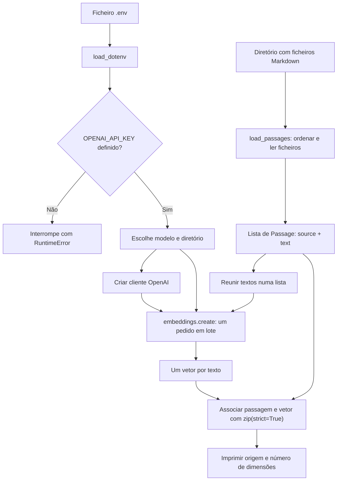

# Exercício 1: criar embeddings para as passagens

Este exercício é a baseline da sessão: lê os documentos Apollo, pede à OpenAI um embedding para cada texto e confirma que a resposta contém vetores. Ainda não guarda os vetores nem faz pesquisa semântica.

## Esquema do fluxo



## Passo a passo

1. **Carrega a configuração.** `load_dotenv()` disponibiliza as variáveis do ficheiro `.env`. O script verifica logo se `OPENAI_API_KEY` existe; se faltar, lança `RuntimeError` antes de começar o processamento.

2. **Escolhe modelo e corpus.** `OPENAI_EMBEDDING_MODEL` permite definir o modelo; por omissão é usado `text-embedding-3-small`. `DOCUMENTS_DIR` aponta para os documentos Markdown fornecidos com o projeto.

3. **Lê as passagens.** `load_passages()` procura os ficheiros `.md`, ordena-os pelo nome e lê cada um como texto UTF-8. Cada ficheiro inteiro é uma passagem neste exercício; não há divisão automática em chunks.

4. **Guarda texto e origem juntos.** A dataclass `Passage` representa cada item com `source` (nome do ficheiro) e `text` (conteúdo). Manter a origem permite associar o vetor ao ficheiro que o produziu.

5. **Cria o cliente da OpenAI.** `OpenAI()` usa a chave configurada no ambiente para preparar o acesso à API.

6. **Gera embeddings em lote.** `create_embeddings()` envia a lista de textos numa chamada a `client.embeddings.create`. A API devolve um vetor numérico para cada texto. Este modelo representa o conteúdo em forma vetorial; não escreve uma resposta para uma pergunta.

7. **Confirma e apresenta os resultados.** `zip(passages, embeddings, strict=True)` associa cada passagem ao respetivo vetor e deteta se as listas tiverem comprimentos diferentes. O script imprime o modelo escolhido, o número de passagens e a dimensão de cada vetor, sem mostrar todos os números.

## O que este exercício ainda não faz

- Não guarda os embeddings em ficheiro ou numa base vetorial; quando o processo termina, os vetores não ficam persistidos.
- Não recebe uma pergunta nem compara vetores. O ranking por similaridade aparece no exercício 2.
- Não usa Chroma, metadata filters nem thresholds; esses passos aparecem no exercício 3.
- Não gera uma resposta em linguagem natural. Produz embeddings e uma pequena confirmação no terminal.

Para executar a baseline, a partir da raiz do repositório:

```bash
uv run python sessions/03-embeddings-semantic-search/starter/01_embed_passages.py
```

É necessária uma variável `OPENAI_API_KEY` válida no `.env`. Cada execução volta a pedir embeddings para todos os documentos, pelo que há custo e latência de API; o pedido em lote evita fazer uma chamada separada para cada passagem.
