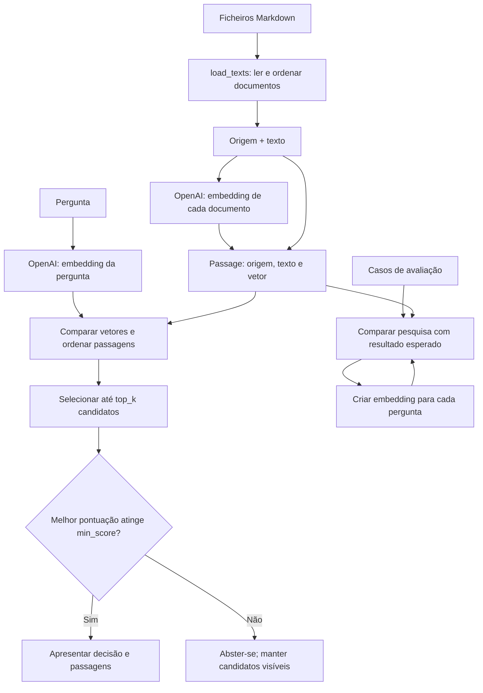

# Exercício 2: pesquisa semântica em memória

Neste exercício, os documentos Apollo são convertidos em embeddings e comparados com o embedding de uma pergunta. O programa ordena passagens candidatas por semelhança e decide se há contexto suficientemente forte para apresentar. Não gera uma resposta em linguagem natural.

## Esquema simplificado



## Passo a passo

1. **Carrega configuração e documentos.** O script lê as variáveis de ambiente, verifica se existe `OPENAI_API_KEY` e carrega os ficheiros Markdown ordenados pelo nome. Neste exercício, cada ficheiro inteiro conta como uma passagem; não há divisão automática em partes.

2. **Cria embeddings dos documentos.** `create_embeddings()` envia os textos à OpenAI em lote. Cada vetor representa aspetos semânticos do texto. O script associa cada vetor ao texto e ao nome do ficheiro numa instância de `Passage`.

3. **Recebe uma pergunta e cria o respetivo embedding.** A pergunta pode vir de `--query` ou ser introduzida no terminal. É convertida num vetor com o mesmo modelo usado para os documentos, para que os vetores possam ser comparados.

4. **Calcula semelhança e ordena candidatos.** `cosine_similarity()` é responsável por comparar dois vetores e rejeitar entradas inválidas. `rank_passages()` avalia cada passagem, ordena os resultados da pontuação mais alta para a mais baixa e limita a lista a `top_k`.

5. **Decide se os candidatos são evidência suficiente.** `decide_search_outcome()` verifica se existe algum resultado e se a melhor pontuação alcança `min_score`. Se não alcançar, o programa abstém-se. Os candidatos continuam no resultado para ser possível inspecionar as pontuações, mesmo quando a decisão é abster-se.

6. **Apresenta a pesquisa ou avalia vários casos.** No modo normal, `print_outcome()` mostra a decisão, as pontuações, as origens e os textos. Com `--evaluate`, o programa pesquisa cada pergunta rotulada e verifica se a origem esperada aparece entre os candidatos ou se a pesquisa se abstém quando isso é esperado.

## Conceitos a observar

- **Semelhança semântica não é prova.** Uma passagem pode usar palavras parecidas com a pergunta e ainda assim não sustentar o que ela afirma. Por isso, o programa tem um limiar e permite abster-se.
- **`top_k` e `min_score` fazem trabalhos diferentes.** `top_k` limita quantos candidatos são mantidos; `min_score` ajuda a decidir se o melhor candidato é forte o suficiente para ser usado.
- **A pontuação não é uma probabilidade.** É uma medida de proximidade entre vetores, útil para ordenar resultados, mas não garante que uma resposta esteja correta. O limiar deve ser observado nos casos de avaliação.
- **A avaliação torna erros visíveis.** Há casos com uma origem esperada e casos que devem levar à abstenção. Em particular, uma pergunta sobre astronautas Apollo que aterraram em Marte partilha palavras com o corpus, embora o evento não tenha ocorrido.
- **O resultado é evidência, não uma resposta gerada.** O programa apresenta passagens encontradas; não chama um modelo de chat para redigir uma resposta.

## Executar

A partir da raiz do repositório, com `OPENAI_API_KEY` configurada no `.env`:

```bash
uv run python sessions/03-embeddings-semantic-search/starter/02_semantic_search.py --query "Which mission first drove a vehicle on the Moon?"
```

Para executar os casos rotulados:

```bash
uv run python sessions/03-embeddings-semantic-search/starter/02_semantic_search.py --evaluate
```

Também é possível experimentar valores diferentes para o número de candidatos e o limiar, sem alterar o código:

```bash
uv run python sessions/03-embeddings-semantic-search/starter/02_semantic_search.py --evaluate --top-k 1 --min-score 0.55
```

O objetivo é implementar e testar as funções em falta no starter. Este guia descreve o fluxo e os conceitos, mas não fornece o código dessas funções.