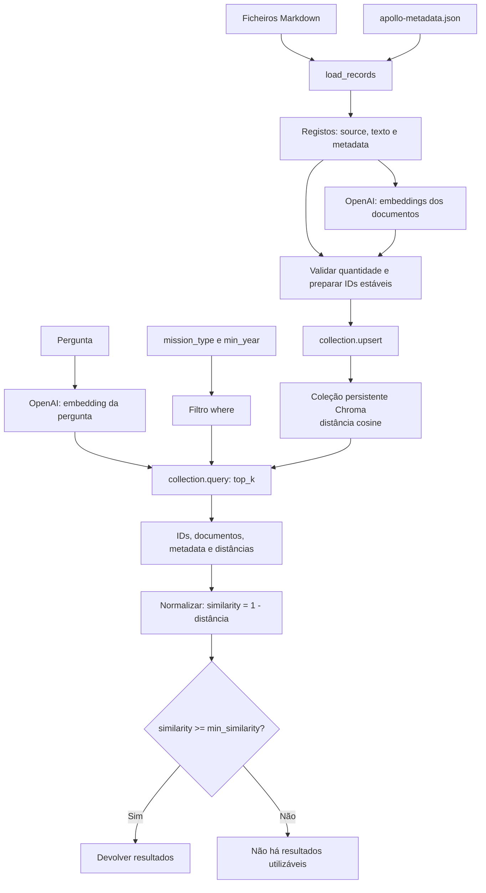

# Exercício 3: Chroma e filtros de metadata

Este exercício junta os passos anteriores: o exercício 1 transforma texto em embeddings; o exercício 2 compara e ordena vetores em memória; aqui, o Chroma guarda esses vetores e permite pesquisar com filtros de metadata. A aplicação continua a criar os embeddings explicitamente com a OpenAI.

## Onde entra o modelo?

`create_embeddings` chama a API da OpenAI com `text-embedding-3-small` (ou o modelo definido em `OPENAI_EMBEDDING_MODEL`). É executada para os textos dos documentos antes de os indexar e para a pergunta antes da pesquisa. O modelo devolve vetores numéricos, não uma resposta em linguagem natural. Portanto, neste exercício não há uma chamada a um modelo de chat ou de geração: o programa devolve os documentos encontrados, a origem e a similaridade. O Chroma não chama o modelo por conta própria, porque a coleção usa `embedding_function=None`.

Como os embeddings dos documentos são novamente pedidos em cada execução do script, repetir uma pesquisa também pode repetir esse custo, mesmo que o `upsert` não duplique os registos.

## Diagrama

Os filtros são enviados ao Chroma na consulta, antes da ordenação vetorial. O limiar é aplicado depois: uma correspondência semanticamente próxima, mas abaixo do limiar, não é devolvida como resultado utilizável.

## Conceitos, vantagens e limitações

### 1. Corpus e metadata

`load_records` associa cada ficheiro Markdown ao item correspondente em `apollo-metadata.json`. O texto é a evidência pesquisável; campos como `mission_type` e `year` descrevem o documento. O carregamento falha se faltar metadata ou se esta mencionar um ficheiro inexistente.

- **Vantagens:** conteúdo e atributos ficam separados; os filtros usam valores controlados em vez de inferirem datas ou categorias a partir do texto.
- **Limitações:** é necessário manter os ficheiros e o JSON sincronizados; metadata errada pode excluir documentos corretos ou incluir documentos irrelevantes.

### 2. Embeddings

`create_embeddings` envia textos à OpenAI e recebe vetores numéricos que representam o seu significado. O exercício calcula vetores para os documentos e para a pergunta, usando o mesmo modelo. O Chroma recebe esses vetores porque a coleção foi criada com `embedding_function=None`.

- **Vantagens:** permite encontrar texto relacionado mesmo quando a pergunta e o documento usam palavras diferentes; vários textos são enviados num só pedido.
- **Limitações:** chamadas externas têm custo, latência e dependem de credenciais e rede; a qualidade depende do modelo e da forma como os documentos foram preparados. Os embeddings não são explicações nem garantem que um resultado responda à pergunta.

### 3. Coleção persistente e distância cosine

`get_collection` abre ou cria a coleção `apollo_missions` em `.chroma/session-03`. A configuração `space: cosine` faz o Chroma ordenar os vetores pela distância cosine. A persistência permite reutilizar o índice entre execuções.

- **Vantagens:** o Chroma gere armazenamento vetorial, pesquisa aproximada e ordenação sem ser necessário comparar todos os vetores manualmente, como no exercício 2.
- **Limitações:** o índice local não é, por si só, uma solução distribuída ou multiutilizador; alterações ao corpus e ao modelo exigem atenção para não misturar embeddings incompatíveis. A pesquisa aproximada pode não produzir exatamente a mesma ordem de uma comparação exaustiva.

### 4. IDs estáveis e `upsert`

`index_documents` usa o nome do ficheiro como ID e grava ID, texto, metadata e embedding juntos. Antes de escrever, confirma que existe exatamente um embedding por registo. `upsert` insere novos IDs e atualiza os existentes, pelo que repetir a indexação não cria duplicados.

- **Vantagens:** a operação é repetível, os resultados mantêm uma referência à origem e a validação evita alinhar um vetor com o documento errado.
- **Limitações:** o nome do ficheiro tem de ser estável e único; se mudar, o Chroma passa a tratar o documento como outro ID. Neste script, todos os textos são novamente enviados para embeddings em cada execução, mesmo que o `upsert` não crie duplicados, pelo que a repetição pode gerar custo e latência.

### 5. Filtros de metadata

`build_where_filter` converte `mission_type` numa igualdade (`$eq`) e `min_year` numa comparação inclusiva (`$gte`). Sem filtros devolve `None`; com os dois, usa `$and`. Assim, `lunar_landing` e ano mínimo de 1970 significam que ambas as condições têm de ser verdadeiras.

- **Vantagens:** restringe a pesquisa por regras previsíveis e combina pesquisa semântica com factos estruturados; filtros podem evitar resultados impossíveis para a tarefa.
- **Limitações:** igualdade exige que o valor esteja correto e escrito da mesma forma; filtros demasiado restritivos podem deixar a pesquisa sem candidatos. Metadata não substitui validação da evidência textual.

### 6. Pesquisa vetorial e `top_k`

A pergunta também é convertida num embedding. `search_collection` envia esse vetor e os filtros ao Chroma, pedindo até `top_k` candidatos. Valores abaixo de um são rejeitados. A ordem dos candidatos reflete a proximidade vetorial dentro do conjunto filtrado.

- **Vantagens:** pesquisa eficiente em coleções maiores e combinação direta com filtros; `top_k` limita o volume de resultados apresentado.
- **Limitações:** `top_k` obriga a devolver candidatos mesmo quando nenhum é relevante; aumentar o valor pode trazer mais ruído. Um candidato no primeiro lugar não é automaticamente uma resposta correta.

### 7. Distância, similaridade e limiar de evidência

O Chroma devolve distância cosine. O código calcula `similarity = 1 - distance` e descarta resultados abaixo de `min_similarity`. Se todos forem descartados, o programa informa que não encontrou resultado que satisfaça o limiar e os filtros.

- **Vantagens:** torna comparável a pontuação com a convenção de similaridade usada nos exercícios anteriores e permite abster-se em pesquisas fracas.
- **Limitações:** a pontuação não é uma probabilidade nem uma medida universal de confiança. Um limiar alto pode remover evidência útil; um limiar baixo pode deixar passar falsos positivos. Deve ser calibrado com casos representativos, como os de `test-data/search-cases.md`.

### 8. Normalização dos resultados

A resposta do Chroma contém listas aninhadas. A função combina IDs, documentos, metadata e distâncias correspondentes e devolve objetos `VectorSearchResult`, com `source`, `text`, `metadata` e `similarity`.

- **Vantagens:** esconde o formato específico da resposta da base de dados e oferece ao resto da aplicação uma estrutura consistente, incluindo a origem para inspeção.
- **Limitações:** a normalização depende de os campos terem sido pedidos e de as listas estarem alinhadas; por isso, o código usa `zip(strict=True)` para detetar comprimentos diferentes em vez de associar dados silenciosamente.

## Controlos da linha de comandos

`--mission-type` e `--min-year` definem filtros; `--top-k` controla quantos candidatos pedir; `--min-similarity` controla quais são devolvidos. `--reset-index` apaga a coleção deste exercício antes de a recriar, útil quando se quer reconstruir o índice. A chave `OPENAI_API_KEY` é necessária para gerar embeddings.

Estes controlos tornam as experiências repetíveis e fáceis de comparar. Em contrapartida, escolher parâmetros não corrige metadata incorreta nem substitui a avaliação com perguntas reais; o ficheiro `test-data/search-cases.md` inclui casos com resultados esperados e casos em que a pesquisa deve abster-se.
