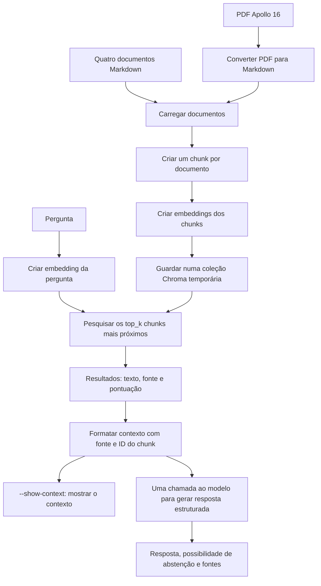

# Sessão 4: guia do pipeline RAG

Esta sessão acompanha uma pergunta desde os documentos até uma resposta apoiada por contexto. A primeira parte é uma baseline completa para observar o processo; as partes seguintes isolam decisões sobre divisão de texto, seleção de contexto e validação de citações.

## 1. Baseline: o percurso de uma pergunta



### Passos

1. **Carregar os documentos.** São lidos os quatro ficheiros Markdown do corpus. O PDF de exemplo é convertido para Markdown com PyMuPDF4LLM antes de ser pesquisado.
2. **Preparar chunks.** Na baseline, cada documento inteiro é um chunk. É uma divisão simples, útil como comparação com as estratégias do exercício 2.
3. **Criar e guardar embeddings.** O texto de cada chunk é enviado ao modelo de embeddings. Os vetores são guardados numa coleção Chroma temporária, que desaparece quando o processo termina.
4. **Pesquisar evidência.** A pergunta também é transformada num vetor. O Chroma devolve até `top_k` chunks próximos por distância cosine. São candidatos relevantes, não uma prova de que respondem à pergunta.
5. **Preparar o contexto.** Os resultados são formatados com o nome da fonte e o ID do chunk. `--show-context` permite ver o texto recuperado que acompanha a pergunta enviada para geração.
6. **Gerar a resposta.** Uma chamada à Responses API devolve os campos estruturados `answer`, `answerable` e `sources`. Se o contexto não permitir responder, o modelo pode indicar que não há informação suficiente.

O carregamento, a criação de chunks, a indexação e a pesquisa são etapas de processamento e recuperação; não são a resposta escrita pelo modelo. A resposta é gerada pelo LLM e pode variar. Nesta baseline, as fontes devolvidas pelo modelo ainda não são verificadas automaticamente. O exercício 3 acrescenta validação de citações.

`--show-loaded-pdf` imprime o Markdown extraído do PDF para inspeção; não altera a pesquisa. A resposta de exemplo usa o facto de Apollo 16 ter explorado a região de Descartes; não é necessário usar uma célula da tabela do PDF.

## 2. Exercício: comparar estratégias de chunking

O objetivo é perceber como a forma de dividir os documentos afeta a recuperação. O tamanho e a sobreposição são controlados por `--chunk-words` e `--overlap-words`.

### Comportamento pedido no README

- **`fixed_size_chunks`:** divide o texto em janelas com um máximo de palavras definido. A sobreposição repete algumas palavras entre janelas vizinhas para reduzir a perda de contexto nas fronteiras. Por exemplo, com 90 palavras e sobreposição de 20, o chunk seguinte começa 20 palavras antes do fim do anterior.
- **Validar tamanho e sobreposição:** configurações sem sentido devem terminar com um erro claro, em vez de produzir chunks inesperados. Em particular, o tamanho tem de ser positivo e a sobreposição não pode impedir o avanço para o texto seguinte.
- **Não perder texto nas fronteiras:** ao percorrer os chunks pela ordem original, todo o texto do documento deve continuar representado. A repetição causada pela sobreposição é intencional; deixar palavras de fora não é.
- **Fonte e ID estáveis:** cada chunk mantém o nome do documento de origem e um identificador que o distingue. Com o mesmo corpus e configuração, a identificação deve manter-se consistente para permitir comparar e exportar resultados.
- **`structure_aware_chunks`:** divide primeiro pelas secções Markdown e inclui o respetivo título como contexto. Se uma secção for grande demais, também é dividida em partes menores, sem perder o título que ajuda a perceber a que assunto pertencem.
- **Relatório de comparação:** mostra a cobertura das fontes esperadas (source recall) e o número e tamanho dos chunks. O recall ajuda a ver se os documentos relevantes chegaram aos resultados; quantidade e tamanho ajudam a perceber o custo e a granularidade de cada estratégia.
- **Comparar configurações e preservar holdout:** experimentar pelo menos duas configurações ajuda a observar o efeito do tamanho e da sobreposição. O relatório usa casos `development`; os casos `holdout` ficam reservados para avaliação posterior. Não escolher uma estratégia apenas pela média: rever erros em nomes exatos, números, perguntas com vários factos e perguntas sem resposta no corpus.
- **Exportar a estratégia escolhida:** `--export-strategy` guarda os chunks escolhidos com texto, fonte, título e ID. O ficheiro é a passagem de dados para o exercício 3, não um índice vetorial permanente.

No workspace atual, o starter deste exercício ainda não está presente. Os pontos acima descrevem o comportamento esperado segundo o README.

## 3. Exercício: geração fundamentada e orçamento de contexto

Este exercício carrega os chunks exportados pelo exercício 2, recupera candidatos e decide quais podem entrar no contexto enviado ao modelo.

### Comportamento pedido no README

- **`select_context`:** percorre os resultados por ordem de relevância, descarta os que ficam abaixo do limiar de similaridade e inclui apenas evidência que caiba no orçamento de tokens. Não deve reordenar os resultados. O orçamento limita o contexto antes de chamar o modelo.
- **Limiar e orçamento são controlos diferentes:** o limiar decide se um resultado é suficientemente semelhante para ser considerado; o orçamento limita o tamanho total do texto selecionado. Um resultado acima do limiar ainda pode não caber no espaço restante.
- **`generate_grounded_answer`:** faz uma única chamada estruturada à Responses API e fornece apenas os chunks selecionados. As instruções devem permitir uma abstenção explícita quando esse contexto não sustenta uma resposta; não se deve completar lacunas com conhecimento externo.
- **`validate_citations`:** verifica se cada fonte existe, se o ID do chunk existe e se a citação apresentada ocorre no texto desse chunk. Uma citação que falhe qualquer uma destas verificações é rejeitada.
- **Resposta gerada e resposta validada são etapas distintas:** o texto produzido pelo LLM não se torna fundamentado só por estar em formato estruturado. A validação verifica os identificadores e a presença literal da citação, mas não prova que a citação implica logicamente a afirmação.
- **Abstenção quando falta evidência:** uma pergunta cuja resposta não consta do corpus deve resultar numa indicação explícita de que não há informação suficiente, em vez de uma resposta inventada.
- **Inspeção manual:** rever pelo menos uma resposta e confirmar que a citação apoia a afirmação. A validação automática confirma a fonte, o chunk e a correspondência literal, não a verdade nem a suficiência do raciocínio.

No workspace atual, o starter deste exercício também ainda não está presente. Os pontos acima descrevem o comportamento esperado segundo o README.

## Dados e comandos

Os documentos Markdown e o PDF de demonstração estão no corpus do projeto; os casos de avaliação incluem conjuntos `development` e `holdout`. Os comandos devem ser executados a partir da raiz do repositório, depois de `uv sync` e de configurar `OPENAI_API_KEY` no `.env`.

```bash
uv run python sessions/04-rag-pipeline/starter/01_rag_baseline.py --query "Which lunar region did Apollo 16 explore?" --show-loaded-pdf --show-context
```

Os comandos dos exercícios 2 e 3 estão descritos no README e dependem dos respetivos starters e da exportação de chunks do exercício 2.