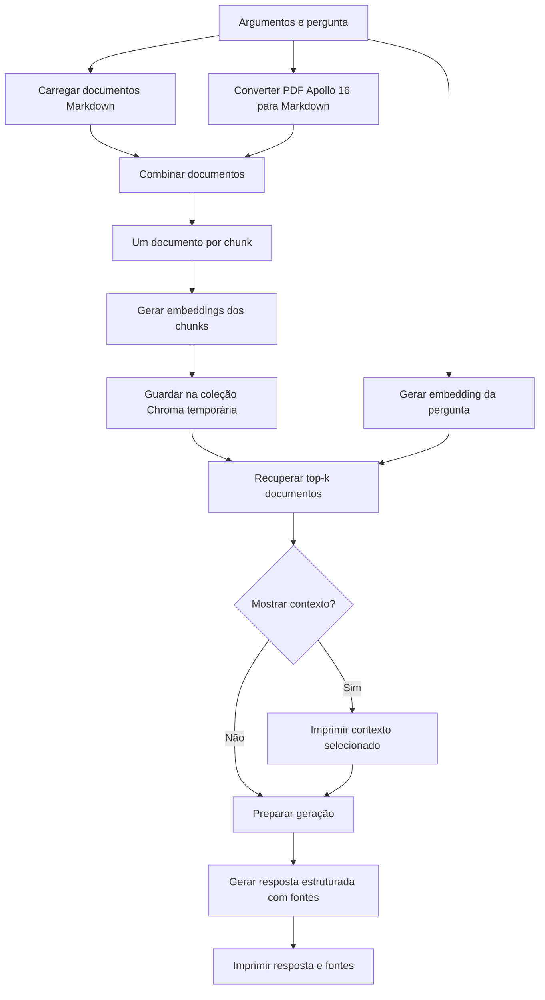
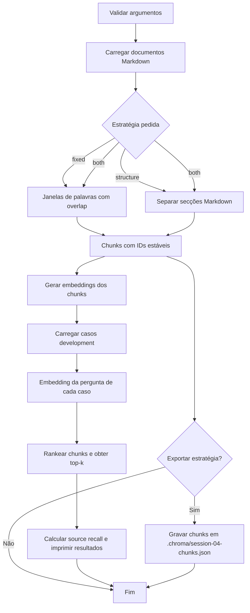
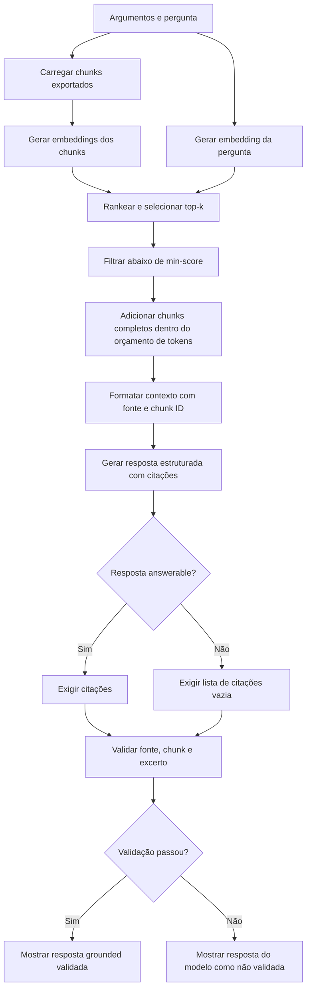

# Fluxos dos exercícios em Mermaid

Diagramas simplificados do caminho executado pelos scripts. Os passos de embeddings e geração usam a API OpenAI; o armazenamento da baseline é local e temporário.

## Conceitos que ligam os três exercícios

- **RAG (Retrieval-Augmented Generation):** antes de responder, o programa procura informação relevante num corpus e fornece essa evidência ao modelo. A resposta fica condicionada ao conteúdo recuperado, em vez de depender apenas do conhecimento geral do modelo.
- **Corpus e documentos:** o corpus é o conjunto de fontes disponíveis. Cada documento mantém a sua origem, título e texto para que a evidência possa ser identificada mais tarde.
- **Chunking:** dividir documentos em unidades menores para facilitar a recuperação. Chunks muito grandes podem misturar assuntos; chunks muito pequenos podem separar factos que precisam de contexto.
- **Embeddings e similaridade:** um embedding representa texto como um vetor numérico. A similaridade entre o vetor da pergunta e os vetores dos chunks ajuda a encontrar trechos semanticamente relacionados, mesmo sem palavras idênticas.
- **Top-k:** limita a recuperação aos `k` resultados mais semelhantes. Um `k` baixo reduz ruído e contexto; um `k` alto aumenta a cobertura, mas pode incluir evidência irrelevante.
- **Contexto e grounding:** os resultados recuperados são formatados como contexto para o modelo. Uma resposta grounded deve ser sustentada por esse contexto e deve abster-se quando ele não contém informação suficiente.
- **Fontes e rastreabilidade:** nomes de ficheiros e IDs de chunks ligam cada excerto à sua origem. Isso permite inspecionar o que foi recuperado e conferir citações.
- **Avaliação:** métricas como `source_recall` ajudam a avaliar se a recuperação encontrou as fontes esperadas. Uma métrica agregada não substitui a inspeção de casos individuais, em especial perguntas sem resposta.

Os exercícios acrescentam estes conceitos gradualmente: o primeiro torna o pipeline visível; o segundo experimenta como a divisão do texto altera a recuperação; o terceiro controla o contexto e verifica as citações.

## Exercício 1: baseline RAG

Script: `starter/01_rag_baseline.py`

- O PDF só é impresso quando se usa `--show-loaded-pdf`.
- O contexto é impresso quando se usa `--show-context`.
- A resposta é gerada com o contexto recuperado e pode indicar que não há informação suficiente.
- **Conceitos em foco:** pipeline RAG de ponta a ponta, embedding de documentos e pergunta, armazenamento vetorial, recuperação semântica e diferença entre evidência recuperada e texto gerado.

## Exercício 2: laboratório de chunking

Script: `starter/02_chunking_lab.py`

- `fixed` divide o texto em janelas de palavras; `structure` divide por título e acrescenta o contexto do documento/secção.
- O `overlap` repete palavras entre chunks vizinhos para reduzir perdas nas fronteiras.
- A avaliação usa apenas o conjunto `development`; `holdout` fica reservado.
- Para exportar, a estratégia escolhida tem de estar incluída em `--strategy`.
- **Conceitos em foco:** tamanho e sobreposição de chunks, preservação de estrutura Markdown, IDs estáveis e avaliação da recuperação. A comparação mostra que chunking é uma decisão de qualidade, não apenas de formatação.

## Exercício 3: geração grounded

Script: `starter/03_grounded_rag.py`

- O orçamento conta o contexto formatado, com as etiquetas de fonte e os separadores.
- Chunks que não cabem são ignorados por inteiro; a ordem dos resultados restantes é preservada.
- A validação confirma que as citações apontam para chunks selecionados e que os excertos aparecem neles. A revisão manual continua necessária para confirmar que sustentam as afirmações.
- **Conceitos em foco:** orçamento de contexto, limiar de similaridade, abstenção, saída estruturada e validação determinística de citações. Encontrar uma citação existente não prova, por si só, que toda a resposta é verdadeira.

git merge ver
